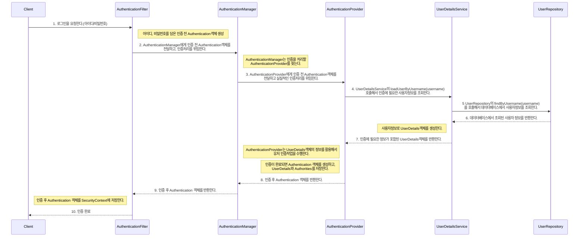

# 폼 로그인 샘플 프로젝트

## 프로젝트 정보

### 프로젝트 정보

- spring boot : 3.3.5
- java : 21
- build : maven
- packaging : war
- groupId : com.example
- artifactId : spring-formlogin

### 라이브러리 의존성

- spring-boot-starter-web
- tomcat-embed-jasper
- jakarta.servlet-api
- jakarta.servlet.jsp.jstl
- jakarta.servlet.jsp.jstl-api  
- spring-boot-starter-security
- spring-security-taglibs  
- h2
- spring-boot-starter-data-jpa
- spring-boot-devtools
- modelmapper
- lombok

### 패키지 및 클래스 정보
- controller
  - HomeController : 요청을 처리하는 컨트롤러 클래스
  - 다양한 컨트롤러 클래스
-  model
  - ERole.java : 사용자 권한 enum
  - User.java : 사용자 정보 엔티티 클래스
- payload.user
  - SignupUserRequest.java : 회원가입 요청 정보를 담는 클래스
- repository
  - UserRepository.java : 사용자 정보에 대한 데이터베이스 엑세스를 제공하는 인터페이스
- security
  - CustomUserDetails.java : 사용자 인증에 필요한 사용자 정보를 표현하는 클래스
  - CustomUserDetailsService.java : 사용자 인증에 필요한 사용자 정보를 제공하는 서비스 클래스
  - LoginUser.java : 로그인된 사용자 정보를 표현하는 클래스
  - SecurityConfig.java : 스프링 시큐리티 설정 클래스
- service
  - UserService.java : 사용자관련 업무로직(회원가입, 수정 등) 서비스를 제공하는 클래스

### 로그인 처리 과정

